<p align="center">
  <a href="https://github.com/dhruvpatel16120/Validra">
    
  </a>
</p>

<h1 align="center">VALIDRA</h1>

<p align="center">
  <strong>Intelligent Product Compliance System</strong><br/>
  <em>"See → Extract → Validate → Explain → Evidence → Report → Review"</em><br/>
  <strong>Team: VisionMinds — Think. Build. Transform.</strong>
</p>

<p align="center">
  
</p>

<p align="center">
  
  
  
  <a href="./LICENSE">
    
  </a>
</p>

<p align="center">
  
  
  
  
  
  
  
</p>

---

## 📖 Overview

**Validra** is an AI-assisted compliance checking system designed to help
inspect packaged commodities against applicable requirements under
India's **Legal Metrology Act, 2009** and **Legal Metrology (Packaged
Commodities) Rules, 2011**.

The platform analyzes product/package images and product information,
extracts mandatory declarations, evaluates them through a rule-based
compliance engine, retrieves relevant legal context using RAG, and
generates evidence-backed compliance reports.

> 🌟 **Smart India Hackathon 2026 — Problem Statement ID: 26034**
> 👥 **Team:** VisionMinds — Think. Build. Transform.

---

## 📑 Table of Contents

- [🎯 Problem](#-problem)
- [💡 Solution](#-solution)
- [🧠 Why Validra?](#-why-validra)
- [🚀 Key Features](#-key-features)
- [🏗️ System Design &amp; Architecture](#-system-design--architecture)
- [🔄 Processing Pipeline](#-processing-pipeline)
- [⚖️ Rule Engine + RAG](#-rule-engine--rag)
- [📊 Confidence-Aware Inspection](#-confidence-aware-inspection)
- [🗃️ Core Data Model](#-core-data-model)
- [🔌 API Overview](#-api-overview)
- [🧩 Technology Stack](#-technology-stack)
- [📁 Repository Structure](#-repository-structure)
- [🧪 Testing Strategy](#-testing-strategy)
- [🛡️ Responsible AI &amp; Legal Disclaimer](#-responsible-ai--legal-disclaimer)
- [🛠️ Development Roadmap](#-development-roadmap)
- [👥 Team Domains](#-team-domains)
- [🤝 Contribution Workflow](#-contribution-workflow)
- [🚀 Getting Started](#-getting-started)
- [📖 Interactive Documentation](#-interactive-documentation)
- [🏆 Smart India Hackathon 2026](#-smart-india-hackathon-2026)
- [📌 Status](#-status)
- [📄 License](#-license)
- [🌟 Support Our Mission](#-support-our-mission)

---

## 🎯 Problem

Packaged commodities sold through retail stores, supermarkets, and
e-commerce platforms are expected to carry prescribed declarations such
as manufacturer/packer/importer details, net quantity, MRP, date-related
information, consumer-care details, and other applicable declarations.

Manual inspection across a large and diverse product ecosystem is
time-consuming and resource-intensive. Validra aims to assist
enforcement personnel by automating the initial inspection, extraction,
validation, evidence collection, and reporting workflow.

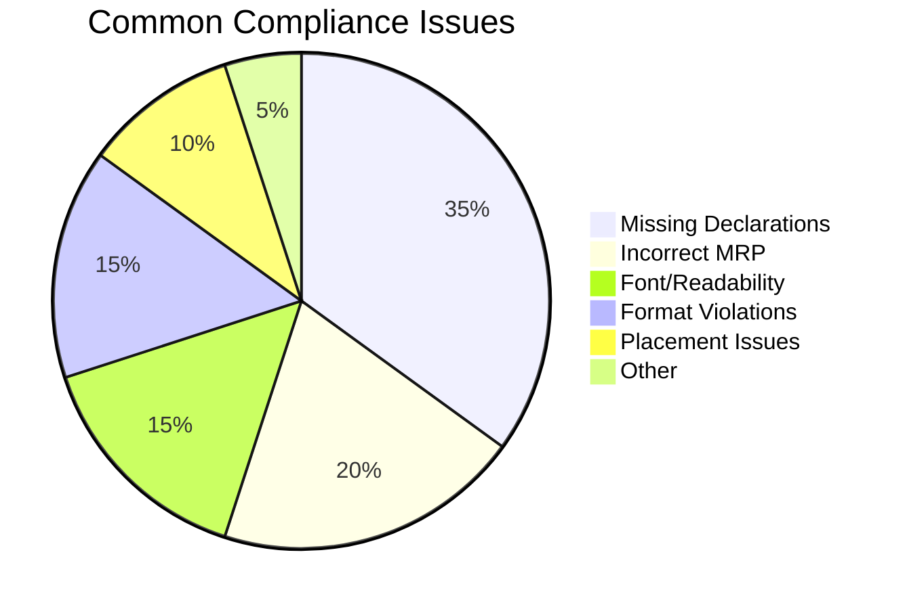

---

## 💡 Solution

Validra follows an evidence-first pipeline:

<p align="center">
  
</p>

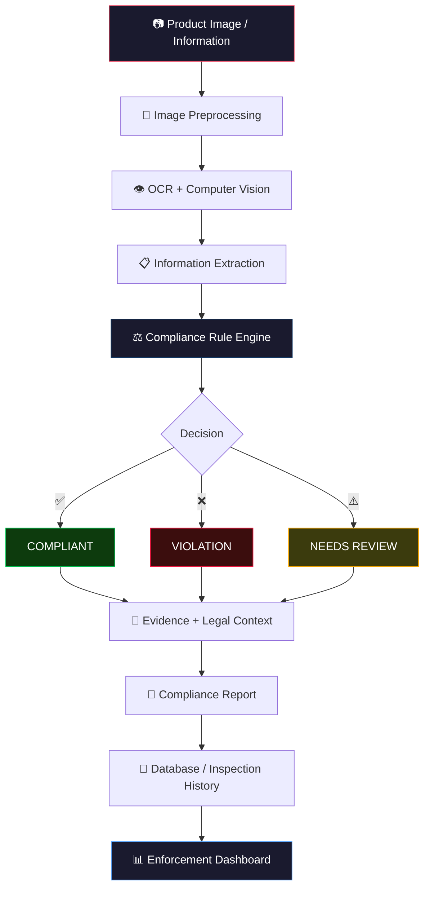

### Core Principle

**AI extracts and assists → Rules evaluate → RAG explains and references
→ Human reviews uncertain cases.**

Validra is a decision-support system, not a replacement for authorized
legal or enforcement judgment. AI/CV outputs are accompanied by
confidence information, and uncertain cases can be routed for manual
review.

---

## 🧠 Why Validra?

| ❌ Traditional Manual Inspection   | ✅ Validra — AI-Assisted Inspection      |
| :--------------------------------- | :---------------------------------------- |
| 🐢 Slow, manual label reading      | ⚡ Instant AI-powered scanning            |
| 📝 Paper-based records             | 💾 Digital evidence preservation          |
| 🧑 Single inspector bottleneck     | 🤖 Scalable, consistent checks            |
| 🔍 Misses subtle violations        | 🎯 Detects missing/incorrect declarations |
| 📊 No analytics or trends          | 📊 Real-time enforcement dashboard        |
| 🗂️ Hard to retrieve past records | 🔎 Searchable inspection history          |

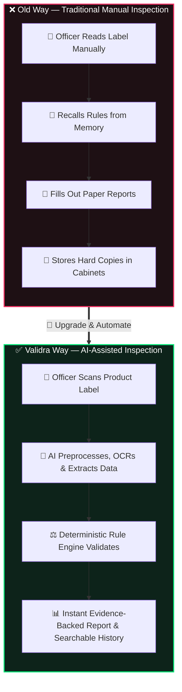

---

## 🚀 Key Features

### 📷 Product Scanning

- Upload or capture packaged commodity images.
- Process package and label images.
- Preserve original and processed evidence.

### 👁️ Computer Vision & OCR

- Image preprocessing using OpenCV.
- Text detection and OCR.
- Bounding-box based text localization.
- Relevant label-region extraction.
- Readability and font-related analysis where technically measurable.

### 🧾 Information Extraction

Identify structured fields such as:

- MRP
- Net quantity
- Manufacturer
- Packer
- Importer
- Manufacturing/packing/import-related date information
- Consumer-care information
- Other applicable declarations

### ⚖️ Rule-Based Compliance Engine

- Check required declarations.
- Validate extracted values and formats.
- Apply category-specific rules where applicable.
- Detect missing or potentially non-compliant declarations.
- Classify findings by severity.
- Maintain rule references and versions.

### 🧠 RAG & Legal Intelligence

- Ingest authoritative legal/regulatory documents.
- Retrieve relevant provisions for findings.
- Provide contextual explanations.
- Connect findings with supporting legal references.

### 📊 Enforcement Dashboard

- Inspection statistics.
- Compliance/non-compliance trends.
- Violation categories.
- Product and inspection history.
- Search and retrieval of previous inspections.

### 📄 Compliance Reports

Generate reports containing:

- Product information
- Extracted declarations
- Compliance status
- Violations
- Evidence images
- Evidence locations
- Confidence values
- Applicable legal references
- Inspection metadata

### 🔐 Security & Authentication

- **Next.js Auth**: Auth.js / NextAuth with Nodemailer for email verification & session management.
- **FastAPI Backend Authorization**: Independent JWT signature, expiration, and RBAC verification on every protected request.
- **Role-Based Access (RBAC)**: Enf## 🏗️ System Design & Architecture

### High-Level System Architecture

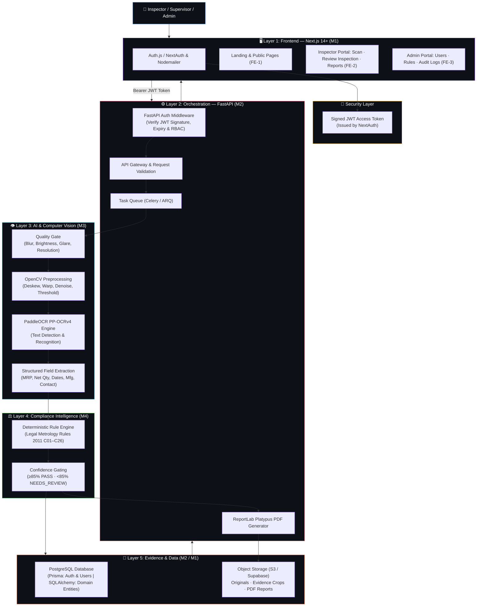

### Dedicated Review Inspection Workflow

Validra operates as an **AI-assisted decision-support system**, not a fully autonomous legal decision-maker. Enforcement decisions incorporate human-in-the-loop oversight:

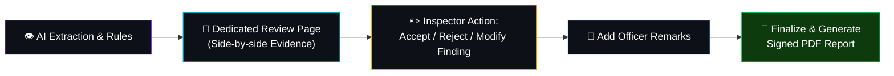

### Five-Layer Architecture

```text
┌────────────────────────────────────────────────────────────────────────┐
│  Layer 1 — USER EXPERIENCE (Next.js 14+ App Router)                   │
│  Landing Pages · Scan Interface · Dedicated Review · Reports · Admin  │
├────────────────────────────────────────────────────────────────────────┤
│  Layer 2 — ORCHESTRATION & GATEWAY (FastAPI)                          │
│  Auth Middleware · REST APIs · Async Task Queue (Celery/ARQ) · Storage │
├────────────────────────────────────────────────────────────────────────┤
│  Layer 3 — AI UNDERSTANDING & COMPUTER VISION                         │
│  Quality Gate · OpenCV Preprocessing · PaddleOCR (PP-OCRv4) · Extract │
├────────────────────────────────────────────────────────────────────────┤
│  Layer 4 — COMPLIANCE INTELLIGENCE                                    │
│  Deterministic Rule Engine · Legal References · Confidence Gating     │
├────────────────────────────────────────────────────────────────────────┤
│  Layer 5 — EVIDENCE & DATA                                            │
│  PostgreSQL (Dual ORM: Prisma + SQLAlchemy) · Object Storage (S3/Supabase)
└────────────────────────────────────────────────────────────────────────┘
```

### Complete Inspection Sequence

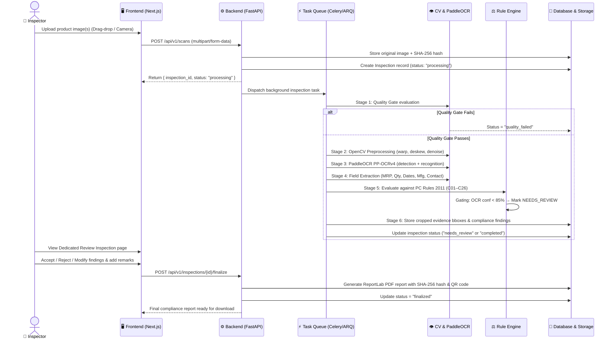

---

## 🔄 Processing Pipeline

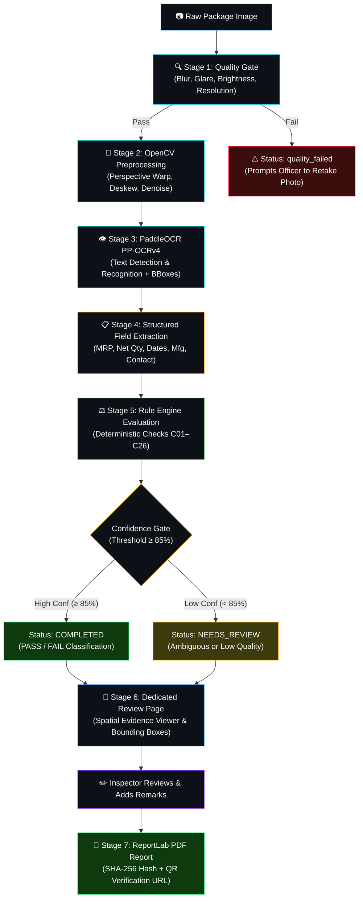

Example OCR output:

```json
{
  "text": "MRP ₹99.00",
  "confidence": 0.97,
  "bbox": [120, 340, 420, 390],
  "bbox_height_px": 50
}
```

Example extracted field:

```json
{
  "mrp": {
    "value": 99.0,
    "currency": "INR",
    "raw_text": "MRP ₹99.00",
    "confidence": 0.97,
    "status": "found"
  }
}
```

---

## ⚖️ Rule Engine & Compliance Intelligence

Validra separates **text detection & extraction** from **compliance evaluation**. 

> **Core Principle:** Computer vision extracts text; the deterministic Rule Engine evaluates compliance against the Legal Metrology (Packaged Commodities) Rules, 2011. Final legal decisions are never made by an autonomous LLM.

### Rule Engine Decision States

| State | Icon | Meaning | Condition |
|:---|:---|:---|:---|
| **Compliant** | ✅ | Declaration complies with legal rules | High confidence (≥ 85%), rule satisfied |
| **Violation** | ❌ | Statutory non-compliance identified | Declaration missing/invalid, high confidence |
| **Needs Review** | ⚠️ | Requires human officer evaluation | OCR confidence `< 85%`, ambiguous units, or image quality issues |
| **Not Applicable** | ⚪ | Rule exempted for package category | Exemption under Rule 26 (e.g. packages ≤ 10g/ml) |

### Legal Metrology Compliance Checks Matrix (C01 to C26)

| Check ID | Declaration / Rule Requirement | Legal Reference | CV Verifiable? |
|:---|:---|:---|:---:|
| **C01** | Package applicability & exemption check | Rule 3, 26 | Partially |
| **C02** | Manufacturer name declaration | Rule 6, 10 | ✅ |
| **C03** | Manufacturer complete address | Rule 6, 10 | ✅ |
| **C04** | Packer name and address (if distinct) | Rule 6, 10 | ✅ |
| **C05** | Importer details (if imported goods) | Rule 6, 10 | ✅ |
| **C06** | Common / generic commodity name | Rule 6(1)(b) | ✅ |
| **C07** | Multipack individual product naming | Rule 6(1)(b) | ✅ |
| **C08** | Net quantity declaration present | Rule 6, 11 | ✅ |
| **C09** | Correct measurement unit for commodity | Rule 12, 13 | ✅ |
| **C10** | Standard SI units compliance (no dozen/gross) | Rule 13 | ✅ |
| **C11** | Month & year of mfg / packing / import | Rule 6(1)(d) | ✅ |
| **C12** | MRP declaration present | Rule 6(1)(e) | ✅ |
| **C13** | MRP inclusive of all taxes declaration | Rule 6(1)(e) | ✅ |
| **C14** | Package physical dimensions (where required) | Rule 6(1)(f), 14–17 | ✅ |
| **C15** | Consumer care contact details | Rule 6(2) | ✅ |
| **C16** | Principal Display Panel (PDP) placement | Rule 7, 8 | Partially |
| **C17** | Quantity numeral minimum height | Rule 7 | ⚠️ Relative |
| **C18** | Declaration letter minimum height | Rule 7 | ⚠️ Relative |
| **C19** | Quantity clear space surrounding | Rule 8 | Partially |
| **C20** | Legibility & prominence | Rule 9 | Partially |
| **C21** | Contrast of declarations against background | Rule 9 | ✅ |
| **C22** | Language requirement (English or Devanagari Hindi) | Rule 9 | ✅ |
| **C23** | No misleading quantity expressions | Rule 12 | ✅ |
| **C24** | Standard pack size compliance | Rule 5, 2nd Sched. | ✅ |
| **C25** | Sticker over original MRP tamper check | Rule 6(3) | ⚠️ Flag |
| **C26** | Deceptive packaging suspicion | Rule 23 | ⚠️ Flag |ff,stroke-width:2px,color:#fff
    style RE fill:#0d1117,stroke:#4caf50,stroke-width:2px,color:#fff
    style RAG fill:#0d1117,stroke:#7c3aed,stroke-width:2px,color:#fff
    style OUT fill:#0d1117,stroke:#ff9800,stroke-width:2px,color:#fff
```

The rule engine provides deterministic validation wherever requirements
can be expressed as rules. RAG retrieves supporting regulatory context
and helps explain findings; it should not independently make the final
legal decision.

### Rule Engine Decision States

| State                   | Icon | Meaning                       | When Used                                    |
| :---------------------- | :--- | :---------------------------- | :------------------------------------------- |
| **Compliant**     | ✅   | Declaration passes validation | High confidence, rule satisfied              |
| **Non-Compliant** | ❌   | Violation detected            | Declaration missing/invalid, high confidence |
| **Needs Review**  | ⚠️ | Uncertain result              | Low OCR/extraction confidence                |

---

## 📊 Confidence-Aware Inspection

Validra tracks uncertainty throughout the AI pipeline.

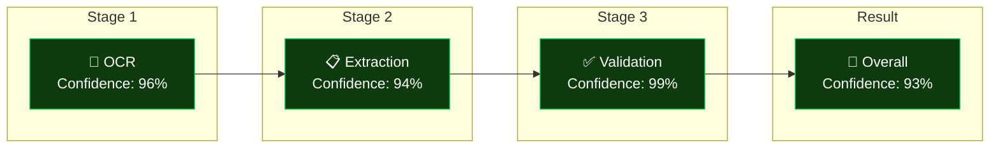

### High vs Low Confidence Examples

| Stage             | ✅ High Confidence | ⚠️ Low Confidence  |
| :---------------- | :----------------- | :------------------- |
| OCR               | 96%                | 48%                  |
| Extraction        | 94%                | 42%                  |
| Validation        | 99%                | —                   |
| **Overall** | **93%**      | **Low**        |
| **Result**  | ✅`COMPLIANT`    | ⚠️`NEEDS REVIEW` |

This reduces false certainty and helps officers focus on ambiguous
cases.

---

## 🗃️ Core Data Model

```mermaid
erDiagram
    USER ||--o{ INSPECTION : creates
    INSPECTION ||--|| PRODUCT : inspects
    INSPECTION ||--o{ IMAGE : has
    INSPECTION ||--o{ EXTRACTED_FIELD : produces
    INSPECTION ||--|| COMPLIANCE_RESULT : generates
    INSPECTION ||--o{ VIOLATION : finds
    VIOLATION }o--|| RULE : references
    INSPECTION ||--o| REPORT : generates

    USER {
        uuid user_id PK
        string name
        string email
        string role
        timestamp created_at
    }

    INSPECTION {
        uuid inspection_id PK
        uuid product_id FK
        uuid inspector_id FK
        string status
        float compliance_score
        timestamp created_at
        timestamp completed_at
    }

    PRODUCT {
        uuid product_id PK
        string name
        string category
        string barcode
    }

    IMAGE {
        uuid image_id PK
        uuid inspection_id FK
        string type
        string storage_path
    }

    EXTRACTED_FIELD {
        uuid field_id PK
        uuid inspection_id FK
        string field_name
        string value
        float confidence
        json bbox
    }

    COMPLIANCE_RESULT {
        uuid result_id PK
        uuid inspection_id FK
        string status
        float score
        int total_rules
        int passed
        int failed
        int review
    }

    VIOLATION {
        uuid violation_id PK
        uuid inspection_id FK
        uuid rule_id FK
        string violation_type
        string description
        string severity
        float confidence
        json bbox
        string evidence_image
    }

    RULE {
        uuid rule_id PK
        string rule_code
        string field
        boolean required
        string validation
        string severity
        string legal_reference
        date effective_date
    }

    REPORT {
        uuid report_id PK
        uuid inspection_id FK
        string format
        string storage_path
        timestamp generated_at
    }
### Database Architecture: Dual-ORM Strategy

Validra uses **two ORMs** accessing the **same PostgreSQL database**:

| ORM | Scope | Managed Entities |
|:---|:---|:---|
| **Prisma** | Frontend (Next.js & NextAuth) | `users`, `accounts`, `sessions`, `verification_tokens`, `password_reset_tokens` |
| **SQLAlchemy 2.0** | Backend (FastAPI Domain) | `products`, `inspections`, `images`, `ocr_runs`, `ocr_text_regions`, `extracted_fields`, `rules`, `compliance_results`, `violations`, `reports`, `audit_logs` |

| Table | Layer | Purpose |
|:---|:---|:---|
| `users` | Prisma / NextAuth | Officer & admin authentication accounts |
| `products` | SQLAlchemy | Inspected product metadata (name, category, barcode, package type) |
| `inspections` | SQLAlchemy | Core inspection lifecycle record & officer remarks |
| `images` | SQLAlchemy | Original, processed, and cropped evidence image storage URIs & SHA-256 hashes |
| `ocr_runs` | SQLAlchemy | PaddleOCR execution metadata, runtime, and raw output JSONB |
| `ocr_text_regions`| SQLAlchemy | Text lines with spatial bounding box polygons (`x1, y1, x2, y2`) and confidence |
| `extracted_fields`| SQLAlchemy | Normalized mandatory fields (MRP, Net Qty, Dates, Mfg, Contact) |
| `rules` | SQLAlchemy | Legal Metrology statutory rules (C01–C26) with versioning & exemptions |
| `compliance_results`| SQLAlchemy | Aggregated inspection compliance score, pass/fail/review counts |
| `violations` | SQLAlchemy | Specific compliance breaches linked to evidence crops & inspector decisions |
| `reports` | SQLAlchemy | Generated PDF report metadata, pipeline versions, SHA-256 hash, and QR code URL |
| `audit_logs` | SQLAlchemy | Immutable security and officer decision audit log entries |

---

## 🔌 API Overview

All backend APIs are versioned under `/api/v1/` and enforce FastAPI JWT signature, expiration, and role validation:

| Method | Endpoint | Purpose | Auth | Role |
|:---|:---|:---|:---:|:---|
| `POST` | `/api/v1/auth/login` | Authenticate user & issue session | ❌ | All |
| `POST` | `/api/v1/scans` | Upload package image & start background scan | ✅ | Inspector |
| `GET` | `/api/v1/scans/{id}` | Check scan processing progress | ✅ | Inspector |
| `GET` | `/api/v1/inspections` | List inspections with pagination & filters | ✅ | Inspector / Supervisor |
| `GET` | `/api/v1/inspections/{id}` | Retrieve complete inspection detail | ✅ | Inspector / Supervisor |
| `PATCH` | `/api/v1/inspections/{id}/findings/{fid}` | Accept, reject, or modify an individual finding | ✅ | Inspector |
| `POST` | `/api/v1/inspections/{id}/finalize` | Finalize inspection & trigger signed PDF generation | ✅ | Inspector |
| `POST` | `/api/v1/reports/{id}` | Generate/regenerate ReportLab PDF report | ✅ | Inspector |
| `GET` | `/api/v1/reports/{id}/download` | Download finalized PDF compliance report | ✅ | Inspector / Supervisor |
| `GET` | `/api/v1/dashboard` | Aggregated compliance & scan metrics | ✅ | Inspector / Supervisor / Admin |
| `GET` | `/api/v1/admin/users` | User management & role administration | ✅ | Admin |
| `POST` | `/api/v1/admin/rules` | Create or update statutory compliance rules | ✅ | Admin |
| `GET` | `/api/v1/admin/audit-logs` | Query immutable system audit logs | ✅ | Admin |

<details>
<summary><strong>📡 Example API Request & Response</strong></summary>

**Start Inspection:**

```http
POST /api/v1/scans
Authorization: Bearer <JWT_TOKEN>
Content-Type: multipart/form-data

image = package_photo.jpg
```

**Response (HTTP 202 Accepted):**

```json
{
  "inspection_id": "INS-000124",
  "status": "processing",
  "message": "Scan job queued for processing"
}
```

**Poll Processing Status:**

```http
GET /api/v1/scans/INS-000124
Authorization: Bearer <JWT_TOKEN>
```

```json
{
  "inspection_id": "INS-000124",
  "status": "needs_review",
  "compliance_score": 78.5,
  "total_rules": 14,
  "passed": 10,
  "failed": 2,
  "needs_review": 2
}
```

</details>

---

## 🧩 Technology Stack

| Layer | Technology | Badge | Purpose |
|:---|:---|:---|:---|
| **Frontend Framework** | Next.js 14+ (App Router) |  | Server Components default, streaming SSR |
| **Language** | TypeScript (Strict) |  | End-to-end type safety |
| **UI & Styling** | Tailwind CSS + shadcn/ui |   | Accessible, token-based design system |
| **Frontend Auth & DB** | NextAuth + Nodemailer + Prisma |  | User auth, email verification, sessions |
| **Backend Framework** | FastAPI (Python 3.11+) |  | High-performance async REST APIs |
| **Backend ORM** | SQLAlchemy 2.0 (async) + Alembic |  | Relational domain persistence & migrations |
| **Task Queue** | Celery / ARQ |  | Asynchronous scan pipeline orchestration |
| **Database** | PostgreSQL 15+ |  | Relational ACID storage (Prisma + SQLAlchemy) |
| **Computer Vision** | OpenCV |  | Image quality gate & label preprocessing |
| **OCR Engine** | PaddleOCR (PP-OCRv4) |  | High-accuracy packaging text detection & OCR |
| **Rule Engine** | Deterministic Python Engine |  | Legal Metrology Rules 2011 (C01–C26) |
| **Object Storage** | S3-compatible / Supabase Storage |  | Raw photos, evidence crops, and PDF reports |
| **Report Generation** | ReportLab Platypus |  | Evidentiary PDF reports with QR verification |

---

## 📁 Repository Structure

```text
validra/
│
├── frontend/                     # Next.js 14+ application
│   ├── prisma/
│   │   ├── schema.prisma         # Prisma schema for Auth & User management
│   │   └── seed.ts               # CLI script for provisioning admin accounts
│   ├── src/
│   │   ├── app/
│   │   │   ├── (landing)/        # FE-1: Container-first public marketing pages
│   │   │   ├── (auth)/           # FE-2: Login, Register, Verify Email
│   │   │   ├── (inspector)/      # FE-2: Dashboard, Scan, Dedicated Review, Reports
│   │   │   └── (admin)/          # FE-3: Admin dashboard, Users, Rules, Audit logs
│   │   └── components/
│   │       ├── ui/               # shadcn shared primitives
│   │       ├── landing/          # Landing container components
│   │       ├── inspector/        # Evidence viewer, Review tables, Scan uploaders
│   │       └── admin/            # Data tables, Rule configurator, Audit viewers
│   └── package.json
│
├── backend/                      # FastAPI application
│   ├── app/
│   │   ├── api/v1/               # Versioned REST endpoints (scans, inspections, reports)
│   │   ├── services/             # Scan orchestrator, Quality gate, Evidence, Reports
│   │   ├── models/               # SQLAlchemy 2.0 domain models
│   │   ├── schemas/              # Pydantic v2 request/response schemas
│   │   └── utils/                # Auth verification, Storage gateway, SHA-256 hashing
│   ├── alembic/                  # Database migration scripts
│   └── requirements.txt
│
├── cv/                           # Computer Vision & OCR pipeline
│   ├── quality_gate.py           # Blur, glare, brightness, and resolution checks
│   ├── preprocessing.py          # Perspective warp, deskew, denoise, adaptive threshold
│   ├── ocr_engine.py             # PaddleOCR PP-OCRv4 detection and recognition wrapper
│   └── field_extractor.py        # Regex & NLP parser for mandatory declarations
│
├── rule-engine/                  # Compliance Rule System
│   ├── rules/                    # Formalized Legal Metrology Rules (C01–C26)
│   ├── evaluators/               # Deterministic field compliance evaluators
│   └── schemas/                  # Compliance result and finding data schemas
│
├── research/                     # Datasets, benchmarks, and Legal Metrology research
├── tests/                        # Unit, integration, CV benchmarking, and E2E tests
│
├── docs/                         # Project Documentation
│   ├── Architecture.md           # 5-Layer architecture & scan pipeline specification
│   ├── Design.md                 # UI/UX, route groups, and Dedicated Review specs
│   ├── PRD.md                    # Functional requirements (FR-01..20) & rules (C01..26)
│   ├── Rules.md                  # Workspace coding standards & team boundaries
│   ├── memory.md                 # Architectural decision log
│   └── blueprints/               # Consolidated system, backend, DB, and frontend blueprints
│
├── implementation.md             # Active implementation tracking
├── .env.example
├── .gitignore
└── README.md
```

---

## 🧪 Testing Strategy

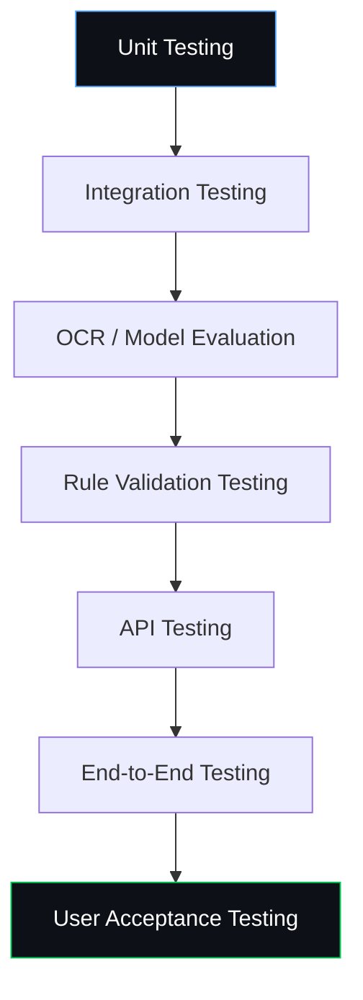

Important test cases include:

- Clear images
- Blurred images
- Rotated images
- Low-light images
- Missing declarations
- Incorrect formats
- OCR errors
- Low-confidence extraction
- Multiple product categories
- Conflicting information
- API failures
- Unauthorized access
- Report-generation failures

### Evaluation Metrics

| Domain                      | Metrics                                                                                      |
| :-------------------------- | :------------------------------------------------------------------------------------------- |
| **OCR / Extraction**  | Character/Word Error Rate, Field Accuracy, Precision, Recall, F1-score                       |
| **Computer Vision**   | Detection Precision/Recall, IoU where applicable                                             |
| **Compliance Engine** | Rule Validation Accuracy, False-Positive Rate, False-Negative Rate, Violation Classification |
| **System**            | Average Processing Time, API Latency, Successful Processing Rate, Report Generation Time     |

---

## 🛡️ Responsible AI & Legal Disclaimer

Validra is an **AI-assisted inspection and decision-support system**.

The system should:

- ✅ Preserve supporting evidence.
- ✅ Display confidence levels.
- ✅ Provide applicable rule references.
- ✅ Flag uncertain cases for manual review.
- ❌ Avoid presenting low-confidence AI outputs as definitive legal
  conclusions.

> **Final legal interpretation and enforcement action should remain with the authorized authority.**

---

## 🛠️ Development Roadmap

```mermaid
flowchart TD
    subgraph P1["Phase 1: 🏗️ Foundation"]
        direction TB
        P1A["Repo Setup"] --> P1B["Next.js + FastAPI Skeleton"]
        P1B --> P1C["PostgreSQL Schema"]
        P1C --> P1D["Auth & API Contracts"]
    end

    subgraph P2["Phase 2: 🔧 Core AI Pipeline"]
        direction TB
        P2A["Image Upload API"] --> P2B["OpenCV Preprocessing"]
        P2B --> P2C["OCR & Bounding Boxes"]
        P2C --> P2D["Field Extraction & Initial Rules"]
    end

    subgraph P3["Phase 3: 🧠 Compliance Intelligence"]
        direction TB
        P3A["Rule Repository & Evaluator"] --> P3B["Violation Classification"]
        P3B --> P3C["Confidence Propagation"]
        P3C --> P3D["Evidence Region Localization"]
    end

    subgraph P4["Phase 4: 📚 Legal RAG Engine"]
        direction TB
        P4A["Legal Doc Ingestion"] --> P4B["Chunking & Embeddings"]
        P4B --> P4C["Vector Search & Retrieval"]
        P4C --> P4D["Contextual Explanation Gen"]
    end

    subgraph P5["Phase 5: 🚀 Productization"]
        direction TB
        P5A["Enforcement Dashboard"] --> P5B["Inspection History & Search"]
        P5B --> P5C["PDF Compliance Reports"]
        P5C --> P5D["Role-Based Access & Audit Logs"]
    end

    subgraph P6["Phase 6: ✅ Validation & Deployment"]
        direction TB
        P6A["Model & Rule Benchmarking"] --> P6B["End-to-End System Testing"]
        P6B --> P6C["Security Audits & Optimization"]
        P6C --> P6D["Production Deployment & SIH Demo"]
    end

    P1 --> P2 --> P3 --> P4 --> P5 --> P6

    style P1 fill:#0d1117,stroke:#58a6ff,stroke-width:2px,color:#fff
    style P2 fill:#0d1117,stroke:#00bcd4,stroke-width:2px,color:#fff
    style P3 fill:#0d1117,stroke:#ff9800,stroke-width:2px,color:#fff
    style P4 fill:#0d1117,stroke:#7c3aed,stroke-width:2px,color:#fff
    style P5 fill:#0d1117,stroke:#e94560,stroke-width:2px,color:#fff
    style P6 fill:#0d1117,stroke:#00c853,stroke-width:2px,color:#fff
```

### Phase 1 — Foundation

- [ ] Repository setup
- [ ] Next.js frontend
- [ ] FastAPI backend
- [ ] PostgreSQL schema
- [ ] Authentication
- [ ] API contracts

### Phase 2 — Core AI Pipeline

- [ ] Image upload
- [ ] OpenCV preprocessing
- [ ] OCR integration
- [ ] Bounding-box extraction
- [ ] Mandatory-field extraction
- [ ] Initial compliance rules

### Phase 3 — Compliance Intelligence

- [ ] Rule repository
- [ ] Rule evaluator
- [ ] Violation classification
- [ ] Confidence propagation
- [ ] Evidence localization

### Phase 4 — RAG

- [ ] Legal document ingestion
- [ ] Chunking
- [ ] Embeddings
- [ ] Vector search
- [ ] Relevant-rule retrieval
- [ ] Explanation generation

### Phase 5 — Productization

- [ ] Enforcement dashboard
- [ ] Inspection history
- [ ] PDF reports
- [ ] Search and filtering
- [ ] Role-based access
- [ ] Audit logs

### Phase 6 — Validation & Deployment

- [ ] Dataset creation
- [ ] Model benchmarking
- [ ] End-to-end testing
- [ ] Security testing
- [ ] Performance optimization
- [ ] Deployment
- [ ] Documentation
- [ ] SIH demonstration

---

## 👥 Team Domains

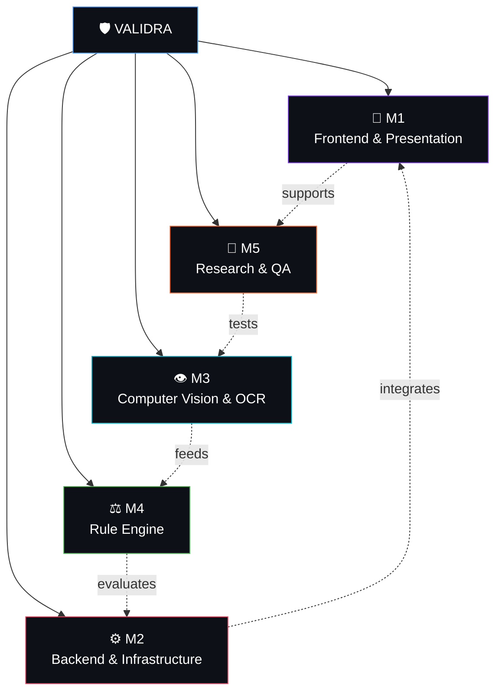

| Module | Domain | Responsibility | Path Boundaries |
|:---|:---|:---|:---|
| **M1** | 🎨 **Frontend & Presentation** | Next.js 14+ App Router, UI/UX, landing containers, dedicated review UI, admin portal | `frontend/` |
| **M2** | ⚙️ **Backend & Infrastructure** | FastAPI, REST APIs, PostgreSQL Dual-ORM (Prisma/SQLAlchemy), task queue, PDF reports | `backend/`, `db/` |
| **M3** | 👁️ **Computer Vision & OCR** | OpenCV preprocessing, Quality Gate, PaddleOCR PP-OCRv4, field extraction | `cv/` |
| **M4** | ⚖️ **Rule Engine** | Legal Metrology Rules 2011 (C01–C26), deterministic validation, compliance scoring | `rule-engine/` |
| **M5** | 🔬 **Research & QA** | Legal research, benchmark datasets, rule validation testing, E2E testing, SIH docs | `research/`, `tests/` |

All members contribute to integration, debugging, and final system
validation.

---

## 🤝 Contribution Workflow

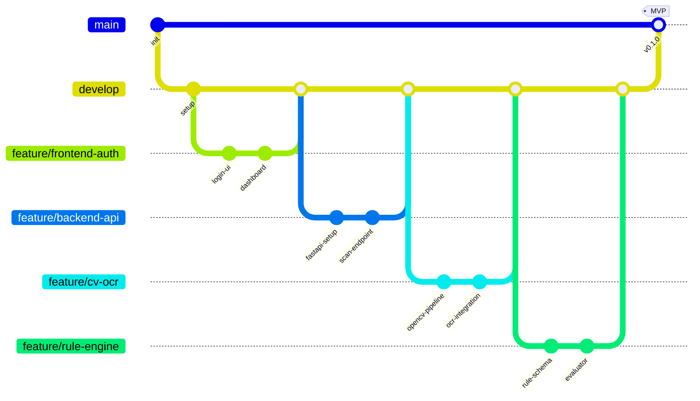

Recommended Git workflow:

```text
main
 │
 └── develop
       │
       ├── feature/frontend-*   (M1)
       ├── feature/backend-*    (M2)
       ├── feature/cv-*         (M3)
       ├── feature/rule-engine-* (M4)
       ├── feature/rag-*        (M5)
       └── feature/qa-*         (M6)
```

### 📋 Issue & Pull Request Templates

We have established end-to-end GitHub templates for streamlined tracking:

- 🐛 **[Bug Report Form](https://github.com/dhruvpatel16120/Validra/issues/new?template=bug_report.yml)** — Structured bug submission tagged by team domain (M1–M6) & component type.
- 💡 **[Feature Request Form](https://github.com/dhruvpatel16120/Validra/issues/new?template=feature_request.yml)** — Propose new features with user story and acceptance criteria.
- ⚖️ **[Legal Rule Addition Form](https://github.com/dhruvpatel16120/Validra/issues/new?template=rule_addition.yml)** — Formalize Legal Metrology Act/PC Rules into machine rules.
- 🔬 **[QA &amp; Benchmarking Task Form](https://github.com/dhruvpatel16120/Validra/issues/new?template=qa_test_task.yml)** — Track OCR evaluation runs, test datasets, and performance tests.
- 🔀 **[PR Templates](.github/PULL_REQUEST_TEMPLATE.md)** — Standardized PR templates with domain tags (M1–M6), type selectors (`frontend`, `backend`, `db`), testing checklists, and visual evidence sections.

> 📖 **End-to-End Collaboration & CI/CD Automation Guides:** See [`docs/TEAM_COLLABORATION_GUIDE.md`](docs/TEAM_COLLABORATION_GUIDE.md) & [`docs/CI_CD_WORKFLOW_AUTOMATION.md`](docs/CI_CD_WORKFLOW_AUTOMATION.md) for full module boundaries, auto-closing issue keywords (`Closes #123`), repo owner approval workflows, CI/CD testing, and automated Kanban project board configuration.

Before opening a pull request:

- ✅ Keep changes focused.
- ✅ Tag primary domain (`M1` to `M6`) and component type (`frontend`, `backend`, `db`, `cv`, `rule-engine`, `rag`, `qa`).
- ✅ Test locally.
- ✅ Update documentation when required.
- ❌ Never commit secrets or `.env` files.
- ✅ Add/update tests for important functionality.
- ✅ Explain what changed and attach visual/test evidence.

---

## 🚀 Getting Started

### Prerequisites

| Tool        | Version | Purpose                      |
| :---------- | :------ | :--------------------------- |
| Git         | Latest  | Version control              |
| Node.js     | 18+ LTS | Frontend runtime             |
| Python      | 3.10+   | Backend + AI                 |
| PostgreSQL  | 15+     | Database                     |
| OCR/CV deps | —      | Required OCR/CV dependencies |

> 📖 **New to development?** Check our **[Base Setup Guide](./docs/setup/base_setup.mdx)** for step-by-step installation instructions starting from scratch!

### Clone

```bash
git clone https://github.com/dhruvpatel16120/Validra.git
cd validra
```

### Frontend

```bash
cd frontend
npm install
npm run dev
```

### Backend

```bash
cd backend
python -m venv .venv

# Linux/macOS
source .venv/bin/activate

# Windows
.venv\Scripts\activate

pip install -r requirements.txt
uvicorn app.main:app --reload
```

> ⚠️ **Important:** Create your local `.env` from `.env.example`. Never commit API keys, passwords, or private credentials.

---

## 📖 Interactive Documentation

Validra uses **MDX** (Markdown + JSX) for interactive, component-rich documentation with embedded **Mermaid diagrams** for visual system explanations.

### 🟢 Environment & Setup Guides

| Document | Description | Status |
| :--- | :--- | :---: |
| [`docs/setup/base_setup.mdx`](./docs/setup/base_setup.mdx) | 🟢 Base environment setup guide (Git, IDE, Node, Python, PostgreSQL) |  ✅ Available  |
| [`docs/setup/backend_setup.mdx`](./docs/setup/backend_setup.mdx) | 🟣 Backend development environment setup & runner guide |  ✅ Available  |
| [`docs/setup/frontend_setup.mdx`](./docs/setup/frontend_setup.mdx) | 🔵 Frontend development environment setup & runner guide |  ✅ Available  |

### 🟡 Team & Workflow Guides

| Document | Description | Status |
| :--- | :--- | :---: |
| [`docs/team-guide/Team_Role.md`](./docs/team-guide/Team_Role.md) | 👥 Team domain ownership mapping (M1–M6) |   ✅ Active   |
| [`docs/team-guide/WORKFLOW_GUIDE.md`](./docs/team-guide/WORKFLOW_GUIDE.md) | 🤝 GitHub issue creation & PR submission workflow guide |  ✅ Available  |
| [`docs/team-guide/TEAM_COLLABORATION_GUIDE.md`](./docs/team-guide/TEAM_COLLABORATION_GUIDE.md) | 🟡 Team domain boundaries, branching & GitHub Projects guide |  ✅ Available  |
| [`docs/team-guide/CI_CD_WORKFLOW_AUTOMATION.md`](./docs/team-guide/CI_CD_WORKFLOW_AUTOMATION.md) | 🛡️ CI/CD testing, branch protection rules & auto-closing issue guide |  ✅ Available  |


### 🔵 Architecture & Feature Specifications

| Document | Description | Status |
| :--- | :--- | :---: |
| [`docs/frontend/Design.md`](./docs/frontend/Design.md) | 🎨 UI/UX specifications & review inspection design |   ✅ Active   |
| `docs/architecture.md` | System architecture deep-dive | 🔜 Planned |
| `docs/api.md` | API documentation & endpoint contracts | 🔜 Planned |
| `docs/database.md` | Database schema & migration guide | 🔜 Planned |
| `docs/cv-pipeline.md` | CV & OCR pipeline documentation | 🔜 Planned |
| `docs/rule-engine.md` | Legal compliance rule engine documentation | 🔜 Planned |
| `docs/rag.md` | Legal RAG retrieval pipeline documentation | 🔜 Planned |
| `docs/testing.md` | Testing strategy & evaluation metrics | 🔜 Planned |

### Why MDX + Mermaid?

- 📊 **Mermaid Diagrams** — Flowcharts, sequence diagrams, ER diagrams, and more rendered directly in documentation
- ⚛️ **MDX Components** — Interactive callouts, tabs, steps, and code blocks
- 🔄 **Version Controlled** — Documentation lives with the code
- 🎨 **Beautiful Rendering** — Rich formatting with syntax highlighting

---

## 🏆 Smart India Hackathon 2026

| Field                       | Details                                                  |
| :-------------------------- | :------------------------------------------------------- |
| **Team Name**         | **VisionMinds — Think. Build. Transform.**        |
| **Problem Statement** | 26034                                                    |
| **Organization**      | Ministry of Consumer Affairs, Food & Public Distribution |
| **Department**        | Department of Consumer Affairs (DoCA)                    |
| **Category**          | Software                                                 |
| **Theme**             | Miscellaneous                                            |
| **Project**           | **Validra — Intelligent Product Compliance**      |

> **Validra — Intelligent Product Compliance.**

---

## 📌 Status

🚧 **Active Development**

The architecture and module boundaries are being established. Model
selection, rule coverage, datasets, and implementation details will be
validated experimentally during development.

---

## 📄 License

Distributed under the terms of the **Apache License 2.0**. See [`LICENSE`](./LICENSE) for full details and license text.

---

## 🌟 Support Our Mission

> 💡 **Enforcement Intelligence for Consumer Protection**

If you find **Validra** impactful, innovative, or useful in advancing AI-powered compliance for Legal Metrology, please consider giving this repository a **Star**! ⭐ Your support helps us gain visibility, foster open-source collaboration, and bridge the digital enforcement gap.

<p align="center">
  <a href="https://github.com/dhruvpatel16120/Validra">
    
  </a>
</p>

<br/>

<p align="center">Made with ❤️ for <b>Smart India Hackathon 2026</b> by <b>VisionMinds — Think. Build. Transform.</b></p>
